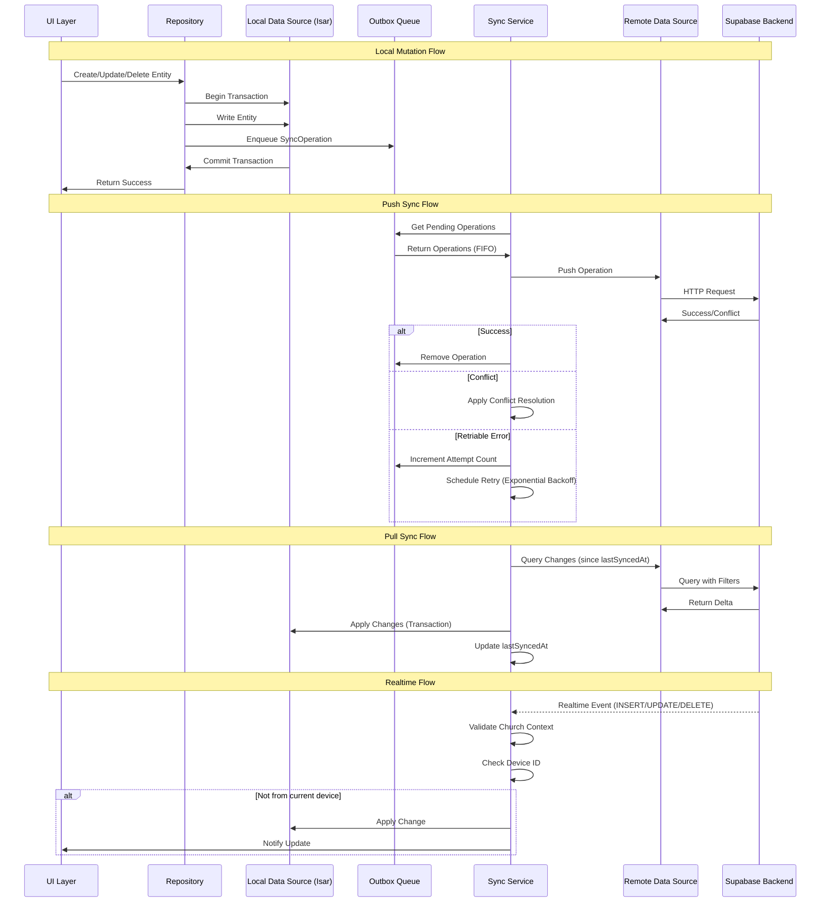
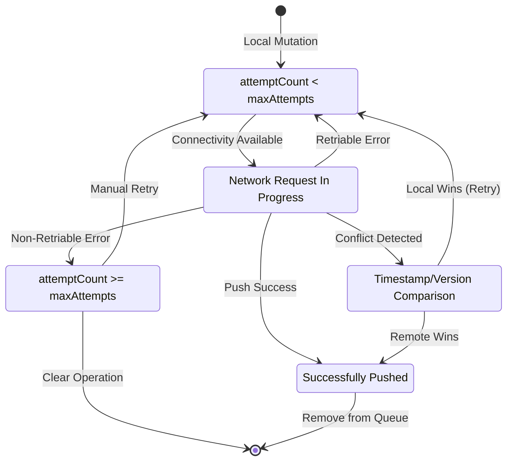

# Design Document: Lumina Robust Sync Architecture

## Overview

This document specifies the technical design for a production-grade offline/online synchronization architecture for Lumina, a Flutter church management application. The system implements an offline-first architecture with reliable bidirectional synchronization between Isar (local database) and Supabase (remote backend).

### Core Design Principles

1. **Offline-First**: All operations work locally first, with synchronization happening asynchronously
2. **Eventual Consistency**: All devices converge to the same state given sufficient time and connectivity
3. **Multi-Tenant Security**: Church data isolation enforced at all architectural layers
4. **Conflict Resolution**: Deterministic Last Write Wins strategy using timestamps and version numbers
5. **Reliability**: Outbox pattern ensures no data loss even during connectivity failures
6. **Observability**: Comprehensive sync status exposed to UI for user transparency

### Key Technologies

- **Flutter/Dart**: Cross-platform mobile framework
- **Isar 3.1.0+1**: High-performance local NoSQL database with ACID transactions
- **Supabase 2.12.2**: PostgreSQL-based backend with realtime subscriptions and RLS
- **Riverpod 2.6.1**: State management for reactive sync status
- **Connectivity Plus 7.0.0**: Network connectivity detection
- **WorkManager 0.9.0+3**: Background sync scheduling

## Architecture

### Layered Architecture

The sync architecture follows Clean Architecture principles with clear separation of concerns:

```
┌─────────────────────────────────────────────────────────────┐
│                     Presentation Layer                       │
│  (UI Widgets, Riverpod Providers, Sync Status Display)      │
└────────────────────────┬────────────────────────────────────┘
                         │
┌────────────────────────▼────────────────────────────────────┐
│                      Domain Layer                            │
│  (Repositories, Entities, Use Cases, Business Logic)        │
└────────────┬───────────────────────────────┬────────────────┘
             │                               │
┌────────────▼──────────────┐   ┌───────────▼────────────────┐
│   Local Data Source        │   │  Remote Data Source        │
│   (Isar Database)          │   │  (Supabase Client)         │
└────────────────────────────┘   └────────────────────────────┘
```


### Sync Flow Architecture




### State Machine: Sync Operation Lifecycle



## Components and Interfaces

### 1. Sync Metadata (Mixin)

All Isar entity models must include sync metadata fields. This is implemented as a mixin for reusability:

```dart
/// Mixin providing synchronization metadata for Isar entities
mixin SyncMetadata {
  /// Timestamp of last modification (UTC)
  late DateTime updatedAt;
  
  /// Optimistic locking version number
  late int version;
  
  /// Soft delete flag
  late bool isDeleted;
  
  /// Device identifier that made the last change
  late String deviceId;
  
  /// Church identifier for multi-tenant isolation
  late String churchId;
  
  /// User identifier who created the entity
  late String createdBy;
  
  /// Timestamp of last successful sync (nullable)
  DateTime? lastSyncedAt;
  
  /// Current synchronization status
  @Enumerated(EnumType.name)
  late SyncStatus syncStatus;
}

enum SyncStatus {
  synced,    // Successfully synchronized
  pending,   // Awaiting synchronization
  conflict,  // Conflict detected
  error      // Synchronization failed
}
```


### 2. SyncOperation Entity (Outbox Queue)

The outbox pattern implementation using Isar collection:

```dart
@collection
class SyncOperation {
  Id id = Isar.autoIncrement;
  
  /// Entity type (e.g., "Member", "Event", "Contribution")
  @Index()
  late String entityType;
  
  /// Entity identifier (UUID or Isar ID)
  late String entityId;
  
  /// Operation type
  @Enumerated(EnumType.name)
  late OperationType operationType;
  
  /// JSON payload of the entity
  late String payload;
  
  /// Timestamp when operation was created
  @Index()
  late DateTime createdAt;
  
  /// Number of push attempts
  late int attemptCount;
  
  /// Timestamp of last push attempt
  DateTime? lastAttemptAt;
  
  /// Error message from last failed attempt
  String? error;
  
  /// Church ID for filtering
  @Index()
  late String churchId;
  
  /// Device ID that created the operation
  late String deviceId;
}

enum OperationType {
  create,
  update,
  delete,
  restore  // For soft delete restoration
}
```

**Indexes:**
- `createdAt`: For FIFO ordering
- `entityType`: For batch processing by type
- `churchId`: For multi-tenant filtering


### 3. Repository Interface

Repositories coordinate between local and remote data sources with atomic transactions:

```dart
abstract class BaseRepository<T> {
  /// Create entity with atomic transaction and outbox enqueue
  Future<Result<T>> create(T entity);
  
  /// Update entity with atomic transaction and outbox enqueue
  Future<Result<T>> update(T entity);
  
  /// Soft delete entity with atomic transaction and outbox enqueue
  Future<Result<void>> delete(String id);
  
  /// Query entities (excludes soft-deleted by default)
  Future<Result<List<T>>> getAll({bool includeDeleted = false});
  
  /// Query single entity by ID
  Future<Result<T?>> getById(String id);
  
  /// Query entities for current church context
  Future<Result<List<T>>> getByChurchId(String churchId);
}

/// Example implementation
class MemberRepository extends BaseRepository<Member> {
  final LocalDataSource _localDataSource;
  final String _currentChurchId;
  final String _currentDeviceId;
  final String _currentUserId;
  
  @override
  Future<Result<Member>> create(Member member) async {
    try {
      // Validate church context
      if (member.churchId != _currentChurchId) {
        return Result.failure(ChurchContextMismatchException());
      }
      
      // Enrich with metadata
      final enrichedMember = member.copyWith(
        updatedAt: DateTime.now().toUtc(),
        version: 1,
        isDeleted: false,
        deviceId: _currentDeviceId,
        churchId: _currentChurchId,
        createdBy: _currentUserId,
        syncStatus: SyncStatus.pending,
      );
      
      // Atomic transaction: write entity + enqueue sync operation
      await _localDataSource.isar.writeTxn(() async {
        await _localDataSource.isar.members.put(enrichedMember);
        
        final syncOp = SyncOperation()
          ..entityType = 'Member'
          ..entityId = enrichedMember.id
          ..operationType = OperationType.create
          ..payload = jsonEncode(enrichedMember.toJson())
          ..createdAt = DateTime.now().toUtc()
          ..attemptCount = 0
          ..churchId = _currentChurchId
          ..deviceId = _currentDeviceId;
        
        await _localDataSource.isar.syncOperations.put(syncOp);
      });
      
      return Result.success(enrichedMember);
    } catch (e) {
      return Result.failure(e);
    }
  }
}
```


### 4. Sync Service

The core orchestrator for all synchronization operations:

```dart
class SyncService {
  final LocalDataSource _localDataSource;
  final RemoteDataSource _remoteDataSource;
  final ConnectivityChecker _connectivityChecker;
  final String _currentChurchId;
  final String _currentDeviceId;
  
  /// Push pending operations from outbox to remote
  Future<SyncResult> pushPendingOperations() async {
    if (!await _connectivityChecker.isConnected()) {
      return SyncResult.offline();
    }
    
    final operations = await _localDataSource.getPendingOperations(
      churchId: _currentChurchId,
      limit: 50, // Batch size
    );
    
    int successCount = 0;
    int failureCount = 0;
    
    for (final operation in operations) {
      try {
        final result = await _pushOperation(operation);
        
        if (result.isSuccess) {
          await _localDataSource.removeSyncOperation(operation.id);
          successCount++;
        } else if (result.isConflict) {
          await _handleConflict(operation, result.remoteEntity);
        } else if (result.isRetriable) {
          await _scheduleRetry(operation);
        } else {
          await _markOperationAsError(operation, result.error);
          failureCount++;
        }
      } catch (e) {
        await _handlePushError(operation, e);
        failureCount++;
      }
    }
    
    return SyncResult(
      successCount: successCount,
      failureCount: failureCount,
    );
  }
  
  /// Pull changes from remote since last sync
  Future<SyncResult> pullChanges({bool fullSync = false}) async {
    if (!await _connectivityChecker.isConnected()) {
      return SyncResult.offline();
    }
    
    final lastSyncTimestamp = fullSync 
        ? null 
        : await _getLastSyncTimestamp();
    
    final changes = await _remoteDataSource.queryChanges(
      churchId: _currentChurchId,
      since: lastSyncTimestamp,
    );
    
    await _localDataSource.isar.writeTxn(() async {
      for (final entity in changes) {
        await _applyRemoteChange(entity);
      }
    });
    
    await _updateLastSyncTimestamp(DateTime.now().toUtc());
    
    return SyncResult(successCount: changes.length);
  }
  
  /// Apply conflict resolution strategy
  Future<void> _handleConflict(
    SyncOperation operation,
    dynamic remoteEntity,
  ) async {
    final localEntity = await _getLocalEntity(
      operation.entityType,
      operation.entityId,
    );
    
    // Last Write Wins: Compare timestamps
    if (remoteEntity.updatedAt.isAfter(localEntity.updatedAt)) {
      // Remote wins: accept remote version
      await _localDataSource.isar.writeTxn(() async {
        await _updateLocalEntity(remoteEntity);
        await _localDataSource.removeSyncOperation(operation.id);
      });
    } else if (localEntity.updatedAt.isAfter(remoteEntity.updatedAt)) {
      // Local wins: retry push
      await _scheduleRetry(operation);
    } else {
      // Timestamps equal: compare version numbers
      if (remoteEntity.version > localEntity.version) {
        await _acceptRemoteVersion(operation, remoteEntity);
      } else {
        await _scheduleRetry(operation);
      }
    }
  }
}
```


### 5. Remote Data Source

Isolates all Supabase interactions:

```dart
class RemoteDataSource {
  final SupabaseClient _supabase;
  
  /// Query changes since timestamp with church filter
  Future<List<Map<String, dynamic>>> queryChanges({
    required String entityType,
    required String churchId,
    DateTime? since,
  }) async {
    var query = _supabase
        .from(_getTableName(entityType))
        .select()
        .eq('church_id', churchId);
    
    if (since != null) {
      query = query.gt('updated_at', since.toIso8601String());
    }
    
    final response = await query.order('updated_at');
    return List<Map<String, dynamic>>.from(response);
  }
  
  /// Push entity to remote
  Future<RemoteOperationResult> pushEntity({
    required String entityType,
    required String entityId,
    required OperationType operationType,
    required Map<String, dynamic> payload,
  }) async {
    try {
      switch (operationType) {
        case OperationType.create:
          await _supabase.from(_getTableName(entityType)).insert(payload);
          return RemoteOperationResult.success();
          
        case OperationType.update:
          final response = await _supabase
              .from(_getTableName(entityType))
              .update(payload)
              .eq('id', entityId)
              .select()
              .single();
          return RemoteOperationResult.success(data: response);
          
        case OperationType.delete:
          await _supabase
              .from(_getTableName(entityType))
              .update({'is_deleted': true})
              .eq('id', entityId);
          return RemoteOperationResult.success();
          
        case OperationType.restore:
          await _supabase
              .from(_getTableName(entityType))
              .update({'is_deleted': false})
              .eq('id', entityId);
          return RemoteOperationResult.success();
      }
    } on PostgrestException catch (e) {
      if (e.code == '23505') {
        // Conflict: entity already exists or version mismatch
        return RemoteOperationResult.conflict();
      } else if (e.code?.startsWith('4') ?? false) {
        // 4xx: Non-retriable client error
        return RemoteOperationResult.error(e.message, retriable: false);
      } else {
        // 5xx: Retriable server error
        return RemoteOperationResult.error(e.message, retriable: true);
      }
    } catch (e) {
      return RemoteOperationResult.error(e.toString(), retriable: true);
    }
  }
  
  /// Establish realtime subscription
  RealtimeChannel subscribeToChanges({
    required String entityType,
    required String churchId,
    required Function(RealtimePayload) onEvent,
  }) {
    return _supabase
        .channel('${entityType}_$churchId')
        .onPostgresChanges(
          event: PostgresChangeEvent.all,
          schema: 'public',
          table: _getTableName(entityType),
          filter: PostgresChangeFilter(
            type: PostgresChangeFilterType.eq,
            column: 'church_id',
            value: churchId,
          ),
          callback: onEvent,
        )
        .subscribe();
  }
}
```


### 6. Connectivity Checker

Validates actual connectivity beyond network interface status:

```dart
class ConnectivityChecker {
  final Connectivity _connectivity;
  final SupabaseClient _supabase;
  final _connectivityController = StreamController<ConnectivityState>.broadcast();
  
  ConnectivityState _currentState = ConnectivityState.unknown;
  Timer? _debounceTimer;
  
  Stream<ConnectivityState> get connectivityStream => _connectivityController.stream;
  ConnectivityState get currentState => _currentState;
  
  /// Initialize connectivity monitoring
  void initialize() {
    _connectivity.onConnectivityChanged.listen(_onConnectivityChanged);
    _checkConnectivity(); // Initial check
  }
  
  /// Handle connectivity changes with debouncing
  void _onConnectivityChanged(List<ConnectivityResult> results) {
    _debounceTimer?.cancel();
    _debounceTimer = Timer(Duration(seconds: 2), () {
      _checkConnectivity();
    });
  }
  
  /// Perform real connectivity validation
  Future<void> _checkConnectivity() async {
    final networkResult = await _connectivity.checkConnectivity();
    
    if (networkResult.contains(ConnectivityResult.none)) {
      _updateState(ConnectivityState.offline);
      return;
    }
    
    // Verify actual connectivity with lightweight Supabase request
    try {
      await _supabase.from('health_check').select('id').limit(1).timeout(
        Duration(seconds: 5),
      );
      _updateState(ConnectivityState.online);
    } catch (e) {
      _updateState(ConnectivityState.offline);
    }
  }
  
  void _updateState(ConnectivityState newState) {
    if (_currentState != newState) {
      _currentState = newState;
      _connectivityController.add(newState);
    }
  }
  
  Future<bool> isConnected() async {
    if (_currentState == ConnectivityState.unknown) {
      await _checkConnectivity();
    }
    return _currentState == ConnectivityState.online;
  }
}

enum ConnectivityState {
  online,
  offline,
  unknown,
}
```


### 7. Trash Manager

Manages soft-deleted entities and restoration:

```dart
class TrashManager {
  final Isar _isar;
  final String _currentChurchId;
  final String _currentDeviceId;
  
  /// Get all soft-deleted entities for current church
  Future<List<T>> getTrashItems<T>({
    required String entityType,
    int? limit,
  }) async {
    final collection = _getCollection<T>(entityType);
    
    var query = collection
        .filter()
        .isDeletedEqualTo(true)
        .churchIdEqualTo(_currentChurchId);
    
    if (limit != null) {
      query = query.limit(limit);
    }
    
    return await query
        .sortByUpdatedAtDesc()
        .findAll();
  }
  
  /// Restore a soft-deleted entity
  Future<Result<T>> restore<T>(String entityId, String entityType) async {
    try {
      final entity = await _getCollection<T>(entityType)
          .get(entityId);
      
      if (entity == null) {
        return Result.failure(EntityNotFoundException());
      }
      
      // Validate church context
      if ((entity as dynamic).churchId != _currentChurchId) {
        return Result.failure(ChurchContextMismatchException());
      }
      
      // Atomic transaction: restore entity + enqueue sync operation
      await _isar.writeTxn(() async {
        final restoredEntity = (entity as dynamic).copyWith(
          isDeleted: false,
          updatedAt: DateTime.now().toUtc(),
          version: (entity as dynamic).version + 1,
          deviceId: _currentDeviceId,
          syncStatus: SyncStatus.pending,
        );
        
        await _getCollection<T>(entityType).put(restoredEntity);
        
        final syncOp = SyncOperation()
          ..entityType = entityType
          ..entityId = entityId
          ..operationType = OperationType.restore
          ..payload = jsonEncode((restoredEntity as dynamic).toJson())
          ..createdAt = DateTime.now().toUtc()
          ..attemptCount = 0
          ..churchId = _currentChurchId
          ..deviceId = _currentDeviceId;
        
        await _isar.syncOperations.put(syncOp);
      });
      
      return Result.success(entity);
    } catch (e) {
      return Result.failure(e);
    }
  }
  
  /// Permanently delete entity (admin only)
  Future<Result<void>> permanentDelete(String entityId, String entityType) async {
    try {
      await _isar.writeTxn(() async {
        await _getCollection(entityType).delete(entityId);
        
        // Enqueue delete operation for remote
        final syncOp = SyncOperation()
          ..entityType = entityType
          ..entityId = entityId
          ..operationType = OperationType.delete
          ..payload = jsonEncode({'id': entityId})
          ..createdAt = DateTime.now().toUtc()
          ..attemptCount = 0
          ..churchId = _currentChurchId
          ..deviceId = _currentDeviceId;
        
        await _isar.syncOperations.put(syncOp);
      });
      
      return Result.success(null);
    } catch (e) {
      return Result.failure(e);
    }
  }
}
```


### 8. Sync Status Provider (Riverpod)

Exposes synchronization state to the UI:

```dart
@riverpod
class SyncStatusNotifier extends _$SyncStatusNotifier {
  @override
  SyncStatus build() {
    return SyncStatus.initial();
  }
  
  void updateSyncState(SyncState newState) {
    state = state.copyWith(syncState: newState);
  }
  
  void updatePendingCount(int count) {
    state = state.copyWith(pendingOperationsCount: count);
  }
  
  void updateLastSyncTime(DateTime timestamp) {
    state = state.copyWith(lastSuccessfulSync: timestamp);
  }
  
  void addFailedOperation(FailedOperation operation) {
    state = state.copyWith(
      failedOperations: [...state.failedOperations, operation],
    );
  }
  
  void updateConnectivity(ConnectivityState connectivity) {
    state = state.copyWith(connectivityState: connectivity);
  }
  
  void updateRealtimeStatus(RealtimeStatus status) {
    state = state.copyWith(realtimeStatus: status);
  }
  
  void notifyConflict(ConflictEvent event) {
    state = state.copyWith(
      conflicts: [...state.conflicts, event],
    );
  }
}

@freezed
class SyncStatus with _$SyncStatus {
  const factory SyncStatus({
    required SyncState syncState,
    required int pendingOperationsCount,
    DateTime? lastSuccessfulSync,
    required ConnectivityState connectivityState,
    required RealtimeStatus realtimeStatus,
    required List<FailedOperation> failedOperations,
    required List<ConflictEvent> conflicts,
    String? syncProgress,
  }) = _SyncStatus;
  
  factory SyncStatus.initial() => SyncStatus(
    syncState: SyncState.idle,
    pendingOperationsCount: 0,
    connectivityState: ConnectivityState.unknown,
    realtimeStatus: RealtimeStatus.disconnected,
    failedOperations: [],
    conflicts: [],
  );
}

enum SyncState {
  idle,
  syncing,
  error,
}

enum RealtimeStatus {
  connected,
  disconnected,
  error,
}
```


### 9. Exponential Backoff Strategy

Implements retry logic with exponential delays:

```dart
class ExponentialBackoffStrategy {
  static const int initialDelaySeconds = 1;
  static const int maxDelaySeconds = 300; // 5 minutes
  static const int maxAttempts = 10;
  
  /// Calculate delay for next retry attempt
  static Duration calculateDelay(int attemptCount) {
    if (attemptCount >= maxAttempts) {
      throw MaxAttemptsExceededException();
    }
    
    final delaySeconds = min(
      initialDelaySeconds * pow(2, attemptCount).toInt(),
      maxDelaySeconds,
    );
    
    return Duration(seconds: delaySeconds);
  }
  
  /// Schedule retry with exponential backoff
  static Future<void> scheduleRetry(
    SyncOperation operation,
    Future<void> Function() retryFunction,
  ) async {
    final delay = calculateDelay(operation.attemptCount);
    
    await Future.delayed(delay);
    await retryFunction();
  }
}

/// Error classification for retry decisions
class ErrorClassifier {
  static bool isRetriable(dynamic error) {
    if (error is SocketException) return true;
    if (error is TimeoutException) return true;
    if (error is HttpException) return true;
    
    if (error is PostgrestException) {
      final code = error.code;
      // 5xx server errors are retriable
      if (code != null && code.startsWith('5')) return true;
      // Network errors are retriable
      if (code == 'PGRST301') return true;
      // 4xx client errors are not retriable
      return false;
    }
    
    // Unknown errors are retriable by default
    return true;
  }
}
```


### 10. Realtime Subscription Manager

Manages Supabase realtime subscriptions:

```dart
class RealtimeSubscriptionManager {
  final RemoteDataSource _remoteDataSource;
  final LocalDataSource _localDataSource;
  final String _currentChurchId;
  final String _currentDeviceId;
  final SyncStatusNotifier _syncStatusNotifier;
  
  final Map<String, RealtimeChannel> _activeChannels = {};
  
  /// Subscribe to realtime changes for entity type
  Future<void> subscribe(String entityType) async {
    if (_activeChannels.containsKey(entityType)) {
      return; // Already subscribed
    }
    
    final channel = _remoteDataSource.subscribeToChanges(
      entityType: entityType,
      churchId: _currentChurchId,
      onEvent: (payload) => _handleRealtimeEvent(entityType, payload),
    );
    
    _activeChannels[entityType] = channel;
    _syncStatusNotifier.updateRealtimeStatus(RealtimeStatus.connected);
  }
  
  /// Handle incoming realtime event
  Future<void> _handleRealtimeEvent(
    String entityType,
    RealtimePayload payload,
  ) async {
    // Validate church context
    final churchId = payload.newRecord?['church_id'];
    if (churchId != _currentChurchId) {
      return; // Ignore events from other churches
    }
    
    // Ignore events from current device to avoid redundant updates
    final deviceId = payload.newRecord?['device_id'];
    if (deviceId == _currentDeviceId) {
      return;
    }
    
    switch (payload.eventType) {
      case PostgresChangeEvent.insert:
        await _handleInsert(entityType, payload.newRecord!);
        break;
      case PostgresChangeEvent.update:
        await _handleUpdate(entityType, payload.newRecord!);
        break;
      case PostgresChangeEvent.delete:
        await _handleDelete(entityType, payload.oldRecord!);
        break;
    }
  }
  
  Future<void> _handleInsert(String entityType, Map<String, dynamic> record) async {
    await _localDataSource.isar.writeTxn(() async {
      final entity = _parseEntity(entityType, record);
      await _localDataSource.insertEntity(entityType, entity);
    });
  }
  
  Future<void> _handleUpdate(String entityType, Map<String, dynamic> record) async {
    final localEntity = await _localDataSource.getEntityById(
      entityType,
      record['id'],
    );
    
    if (localEntity != null) {
      // Apply conflict resolution
      final remoteUpdatedAt = DateTime.parse(record['updated_at']);
      final localUpdatedAt = (localEntity as dynamic).updatedAt;
      
      if (remoteUpdatedAt.isAfter(localUpdatedAt)) {
        await _localDataSource.isar.writeTxn(() async {
          final entity = _parseEntity(entityType, record);
          await _localDataSource.updateEntity(entityType, entity);
        });
      }
    } else {
      // Entity doesn't exist locally, insert it
      await _handleInsert(entityType, record);
    }
  }
  
  Future<void> _handleDelete(String entityType, Map<String, dynamic> record) async {
    await _localDataSource.isar.writeTxn(() async {
      await _localDataSource.softDeleteEntity(entityType, record['id']);
    });
  }
  
  /// Unsubscribe from entity type
  Future<void> unsubscribe(String entityType) async {
    final channel = _activeChannels.remove(entityType);
    await channel?.unsubscribe();
    
    if (_activeChannels.isEmpty) {
      _syncStatusNotifier.updateRealtimeStatus(RealtimeStatus.disconnected);
    }
  }
  
  /// Unsubscribe from all channels
  Future<void> unsubscribeAll() async {
    for (final channel in _activeChannels.values) {
      await channel.unsubscribe();
    }
    _activeChannels.clear();
    _syncStatusNotifier.updateRealtimeStatus(RealtimeStatus.disconnected);
  }
}
```


## Data Models

### Entity Metadata Schema

All synchronized entities must include these fields in both Isar and Supabase:

**Isar Schema (Dart):**
```dart
@collection
class Member with SyncMetadata {
  Id id = Isar.autoIncrement;
  
  // Business fields
  late String firstName;
  late String lastName;
  late String email;
  
  // Sync metadata (from mixin)
  @override
  late DateTime updatedAt;
  
  @override
  late int version;
  
  @override
  late bool isDeleted;
  
  @override
  @Index()
  late String deviceId;
  
  @override
  @Index()
  late String churchId;
  
  @override
  late String createdBy;
  
  @override
  DateTime? lastSyncedAt;
  
  @override
  @Enumerated(EnumType.name)
  late SyncStatus syncStatus;
}
```

**Supabase Schema (PostgreSQL):**
```sql
CREATE TABLE members (
  id UUID PRIMARY KEY DEFAULT gen_random_uuid(),
  
  -- Business fields
  first_name TEXT NOT NULL,
  last_name TEXT NOT NULL,
  email TEXT NOT NULL,
  
  -- Sync metadata
  updated_at TIMESTAMPTZ NOT NULL DEFAULT NOW(),
  version INTEGER NOT NULL DEFAULT 1,
  is_deleted BOOLEAN NOT NULL DEFAULT FALSE,
  device_id TEXT NOT NULL,
  church_id UUID NOT NULL REFERENCES churches(id),
  created_by UUID NOT NULL REFERENCES auth.users(id),
  
  -- Indexes for sync performance
  CONSTRAINT members_church_id_idx FOREIGN KEY (church_id) REFERENCES churches(id)
);

CREATE INDEX idx_members_updated_at ON members(updated_at);
CREATE INDEX idx_members_church_id ON members(church_id);
CREATE INDEX idx_members_is_deleted ON members(is_deleted);
CREATE INDEX idx_members_device_id ON members(device_id);
```


### RLS Policies

Row Level Security policies enforce multi-tenant isolation:

```sql
-- Enable RLS on members table
ALTER TABLE members ENABLE ROW LEVEL SECURITY;

-- SELECT policy: Users can only see members from their church
CREATE POLICY members_select_policy ON members
  FOR SELECT
  USING (
    church_id = (auth.jwt() -> 'app_metadata' ->> 'church_id')::UUID
  );

-- INSERT policy: Users can only insert members for their church
CREATE POLICY members_insert_policy ON members
  FOR INSERT
  WITH CHECK (
    church_id = (auth.jwt() -> 'app_metadata' ->> 'church_id')::UUID
  );

-- UPDATE policy: Users can only update members from their church
CREATE POLICY members_update_policy ON members
  FOR UPDATE
  USING (
    church_id = (auth.jwt() -> 'app_metadata' ->> 'church_id')::UUID
  )
  WITH CHECK (
    church_id = (auth.jwt() -> 'app_metadata' ->> 'church_id')::UUID
  );

-- DELETE policy: Users can only delete members from their church
CREATE POLICY members_delete_policy ON members
  FOR DELETE
  USING (
    church_id = (auth.jwt() -> 'app_metadata' ->> 'church_id')::UUID
  );
```

### Sync State Tracking

Track last sync timestamp per entity type:

```dart
@collection
class SyncState {
  Id id = Isar.autoIncrement;
  
  @Index(unique: true)
  late String entityType;
  
  late DateTime lastSyncedAt;
  
  late String churchId;
}
```


## Correctness Properties

*A property is a characteristic or behavior that should hold true across all valid executions of a system—essentially, a formal statement about what the system should do. Properties serve as the bridge between human-readable specifications and machine-verifiable correctness guarantees.*

**Property Reflection:**

After analyzing all 25 requirements with 250+ acceptance criteria, I identified the following testable properties. Many requirements involve infrastructure (Supabase RLS, network connectivity) or schema definitions, which are better suited for integration tests or unit tests. The properties below focus on the core synchronization logic that can be tested with property-based testing.

**Redundancy Analysis:**
- Migration properties (1.9, 1.10, 15.3-15.8) can be combined into comprehensive migration properties
- Atomic transaction properties (2.4, 3.1-3.4, 5.8) can be unified into transaction atomicity properties
- Conflict resolution properties (7.1-7.5, 19.4) are already addressing the same algorithm
- Ordering properties (2.6, 6.2) both test FIFO behavior in different contexts
- Soft delete and restore properties (4.1-4.8, 12.4-12.7) can be combined into comprehensive soft delete properties

### Property 1: Schema Migration Data Preservation

*For any* existing Isar entity with business data, when the schema migration adds sync metadata fields, all original business fields SHALL remain unchanged and accessible.

**Validates: Requirements 1.9, 15.3, 18.1**

### Property 2: Schema Migration Default Initialization

*For any* existing Isar entity without sync metadata, when the schema migration executes, the new metadata fields SHALL be initialized with valid defaults (updatedAt = current time, version = 1, isDeleted = false, syncStatus = pending).

**Validates: Requirements 1.10, 15.4-15.8**

### Property 3: Atomic Transaction Consistency

*For any* repository mutation (create, update, delete), both the entity modification and the SyncOperation enqueue SHALL succeed together or fail together within a single transaction.

**Validates: Requirements 2.4, 3.1-3.4, 5.8**

### Property 4: Transaction Rollback Completeness

*For any* repository mutation that fails during transaction, both the entity state and the outbox queue SHALL be rolled back to their pre-mutation state.

**Validates: Requirements 3.4**


### Property 5: Version Monotonic Increase

*For any* entity update operation, the version number after the update SHALL be strictly greater than the version number before the update.

**Validates: Requirements 3.5**

### Property 6: Outbox Queue Persistence

*For any* set of SyncOperations enqueued in the outbox, after simulating an app restart (closing and reopening the Isar database), all operations SHALL still be present in the queue with identical data.

**Validates: Requirements 2.5**

### Property 7: FIFO Ordering for Same Entity

*For any* sequence of SyncOperations on the same entity, when retrieved from the outbox queue, the operations SHALL be ordered by createdAt timestamp in ascending order (first created, first retrieved).

**Validates: Requirements 2.6, 6.2**

### Property 8: Soft Delete Behavior

*For any* entity delete operation, the entity SHALL have isDeleted set to true, updatedAt updated to current time, and version incremented, while the entity remains physically present in the database.

**Validates: Requirements 4.1-4.3**

### Property 9: Soft Delete Filtering

*For any* repository query with default parameters, the results SHALL NOT include any entities where isDeleted is true.

**Validates: Requirements 4.4**

### Property 10: Soft Delete Round Trip

*For any* entity, performing a delete operation followed by a restore operation SHALL result in the entity having isDeleted = false, with updatedAt and version updated, while all business fields remain unchanged.

**Validates: Requirements 4.6-4.8, 12.4-12.7**

### Property 11: Delta Sync Filtering

*For any* delta sync pull operation with a given lastSyncedAt timestamp, all returned entities SHALL have updatedAt timestamps strictly greater than lastSyncedAt.

**Validates: Requirements 5.2**

### Property 12: Exponential Backoff Calculation

*For any* attempt count n where 0 ≤ n < maxAttempts, the calculated retry delay SHALL equal min(initialDelay * 2^n, maxDelay) seconds.

**Validates: Requirements 6.6, 11.1-11.3**


### Property 13: Conflict Resolution Determinism (Timestamp)

*For any* two conflicting versions of an entity with different updatedAt timestamps, the conflict resolution SHALL always select the version with the later updatedAt timestamp.

**Validates: Requirements 7.1-7.3**

### Property 14: Conflict Resolution Determinism (Version)

*For any* two conflicting versions of an entity with identical updatedAt timestamps, the conflict resolution SHALL always select the version with the higher version number.

**Validates: Requirements 7.4-7.5**

### Property 15: Realtime Event Device Filtering

*For any* realtime event where the deviceId matches the current device's deviceId, the event SHALL be ignored and NOT applied to local storage.

**Validates: Requirements 8.7, 14.6-14.7**

### Property 16: Church Context Validation

*For any* repository mutation with a churchId that does NOT match the current church context, the mutation SHALL be rejected with a ChurchContextMismatchException.

**Validates: Requirements 9.3-9.4**

### Property 17: Sync Operation Serialization Round Trip

*For any* valid entity object, serializing it to JSON payload, then deserializing the payload back to an entity object SHALL produce an entity equivalent to the original (all fields equal).

**Validates: Requirements 21.7**

### Property 18: Invalid JSON Parsing Error

*For any* malformed JSON string, the SyncOperation parser SHALL return a descriptive error rather than throwing an unhandled exception or producing invalid data.

**Validates: Requirements 21.2**

### Property 19: Backward Compatibility Graceful Handling

*For any* entity missing one or more sync metadata fields, the sync service SHALL handle the entity gracefully by backfilling missing fields with defaults rather than crashing or corrupting data.

**Validates: Requirements 18.3-18.4**

### Property 20: Error Preservation in Outbox

*For any* SyncOperation that fails during push, the operation SHALL remain in the outbox queue with attemptCount incremented and error message recorded.

**Validates: Requirements 22.2**


## Error Handling

### Error Classification

The sync architecture classifies errors into three categories:

1. **Retriable Errors**: Transient failures that should be retried with exponential backoff
   - Network timeouts (SocketException, TimeoutException)
   - Server errors (5xx HTTP status codes)
   - Supabase connection errors (PGRST301)
   - Temporary database locks

2. **Non-Retriable Errors**: Permanent failures that should not be retried
   - Validation errors (4xx HTTP status codes)
   - Schema mismatches
   - Authentication failures
   - Church context violations
   - Constraint violations (unique, foreign key)

3. **Critical Errors**: Failures requiring immediate user attention
   - Data corruption detected
   - Migration failures
   - Unrecoverable sync state
   - Security violations

### Error Handling Strategy

```dart
class SyncErrorHandler {
  Future<ErrorHandlingDecision> handleError(
    SyncOperation operation,
    dynamic error,
  ) async {
    // Classify error
    if (ErrorClassifier.isRetriable(error)) {
      if (operation.attemptCount < ExponentialBackoffStrategy.maxAttempts) {
        return ErrorHandlingDecision.retry(
          delay: ExponentialBackoffStrategy.calculateDelay(operation.attemptCount),
        );
      } else {
        return ErrorHandlingDecision.markAsError(
          'Max retry attempts exceeded',
        );
      }
    } else if (ErrorClassifier.isCritical(error)) {
      return ErrorHandlingDecision.notifyUser(
        severity: ErrorSeverity.critical,
        message: _getUserFriendlyMessage(error),
      );
    } else {
      return ErrorHandlingDecision.markAsError(
        _getErrorMessage(error),
      );
    }
  }
}
```

### Circuit Breaker Pattern

To prevent overwhelming the server during extended outages:

```dart
class SyncCircuitBreaker {
  static const int failureThreshold = 5;
  static const Duration resetTimeout = Duration(minutes: 5);
  
  CircuitState _state = CircuitState.closed;
  int _failureCount = 0;
  DateTime? _lastFailureTime;
  
  Future<bool> canAttemptSync() async {
    switch (_state) {
      case CircuitState.closed:
        return true;
        
      case CircuitState.open:
        if (DateTime.now().difference(_lastFailureTime!) > resetTimeout) {
          _state = CircuitState.halfOpen;
          return true;
        }
        return false;
        
      case CircuitState.halfOpen:
        return true;
    }
  }
  
  void recordSuccess() {
    _failureCount = 0;
    _state = CircuitState.closed;
  }
  
  void recordFailure() {
    _failureCount++;
    _lastFailureTime = DateTime.now();
    
    if (_failureCount >= failureThreshold) {
      _state = CircuitState.open;
    }
  }
}

enum CircuitState {
  closed,   // Normal operation
  open,     // Blocking sync attempts
  halfOpen, // Testing if service recovered
}
```


### Error Recovery Mechanisms

1. **Automatic Retry**: Retriable errors trigger exponential backoff retry
2. **Manual Retry**: Users can manually retry failed operations from UI
3. **Clear Queue**: Users can remove failed operations that cannot be resolved
4. **Full Resync**: Users can trigger a full sync to recover from inconsistent state
5. **Diagnostic Export**: Users can export sync logs for support troubleshooting

### Error Logging

All errors are logged with comprehensive context:

```dart
class SyncLogger {
  final Logger _logger;
  
  void logSyncError({
    required String operation,
    required String entityType,
    required String entityId,
    required dynamic error,
    required StackTrace stackTrace,
    required String churchId,
    required String deviceId,
  }) {
    _logger.error(
      'Sync Error',
      error: error,
      stackTrace: stackTrace,
      metadata: {
        'operation': operation,
        'entityType': entityType,
        'entityId': entityId,
        'churchId': churchId,
        'deviceId': deviceId,
        'timestamp': DateTime.now().toIso8601String(),
      },
    );
  }
  
  void logConflictResolution({
    required String entityType,
    required String entityId,
    required Map<String, dynamic> localVersion,
    required Map<String, dynamic> remoteVersion,
    required String winner,
  }) {
    _logger.info(
      'Conflict Resolved',
      metadata: {
        'entityType': entityType,
        'entityId': entityId,
        'localUpdatedAt': localVersion['updatedAt'],
        'remoteUpdatedAt': remoteVersion['updatedAt'],
        'localVersion': localVersion['version'],
        'remoteVersion': remoteVersion['version'],
        'winner': winner,
      },
    );
  }
}
```


## Testing Strategy

### Dual Testing Approach

The sync architecture requires both unit tests and property-based tests for comprehensive coverage:

**Unit Tests** focus on:
- Specific examples and edge cases
- Integration points between components
- Error conditions with specific inputs
- UI state management
- Schema validation

**Property-Based Tests** focus on:
- Universal properties across all inputs
- Comprehensive input coverage through randomization
- Invariants that must hold for all valid data
- Round-trip properties (serialization, soft delete)
- Conflict resolution determinism

### Property-Based Testing Configuration

**Framework**: Use the `test` package with custom property-based testing utilities or integrate `fast_check` equivalent for Dart.

**Configuration**:
- Minimum 100 iterations per property test
- Each property test references its design document property
- Tag format: `@Tags(['pbt', 'Feature: lumina-robust-sync-architecture, Property N'])`

**Example Property Test**:

```dart
@Tags(['pbt', 'Feature: lumina-robust-sync-architecture, Property 17'])
void main() {
  group('Property 17: Sync Operation Serialization Round Trip', () {
    test('for any valid entity, serialize then deserialize produces equivalent entity', () {
      final generator = MemberGenerator();
      
      for (int i = 0; i < 100; i++) {
        // Generate random member entity
        final originalMember = generator.generate();
        
        // Serialize to JSON
        final json = originalMember.toJson();
        final jsonString = jsonEncode(json);
        
        // Deserialize back to entity
        final deserializedJson = jsonDecode(jsonString);
        final deserializedMember = Member.fromJson(deserializedJson);
        
        // Verify equivalence
        expect(deserializedMember.id, equals(originalMember.id));
        expect(deserializedMember.firstName, equals(originalMember.firstName));
        expect(deserializedMember.lastName, equals(originalMember.lastName));
        expect(deserializedMember.email, equals(originalMember.email));
        expect(deserializedMember.updatedAt, equals(originalMember.updatedAt));
        expect(deserializedMember.version, equals(originalMember.version));
        expect(deserializedMember.isDeleted, equals(originalMember.isDeleted));
        expect(deserializedMember.deviceId, equals(originalMember.deviceId));
        expect(deserializedMember.churchId, equals(originalMember.churchId));
        expect(deserializedMember.createdBy, equals(originalMember.createdBy));
      }
    });
  });
}
```


### Unit Test Coverage

**Repository Tests**:
- Test atomic transaction behavior with specific entities
- Test church context validation with valid/invalid churchIds
- Test version increment on updates
- Test soft delete flag setting
- Test query filtering of deleted entities

**Sync Service Tests**:
- Test push operation with specific sync operations
- Test pull operation with specific remote changes
- Test conflict resolution with specific timestamp/version combinations
- Test exponential backoff with specific attempt counts
- Test circuit breaker state transitions

**Connectivity Checker Tests**:
- Test connectivity state transitions
- Test debouncing behavior
- Test Supabase health check with mocked responses

**Trash Manager Tests**:
- Test trash retrieval with specific deleted entities
- Test restore operation with specific entities
- Test permanent delete with specific entities

**Realtime Subscription Tests**:
- Test event handling with specific INSERT/UPDATE/DELETE events
- Test device ID filtering with specific events
- Test church context validation with specific events

### Integration Test Coverage

**Supabase Integration**:
- Test RLS policies with multiple church contexts
- Test realtime subscriptions with live Supabase instance
- Test remote data source operations against Supabase
- Test authentication token management

**Multi-Device Sync**:
- Test sync coordination between two simulated devices
- Test conflict resolution in multi-device scenarios
- Test eventual consistency across devices

**Offline/Online Transitions**:
- Test outbox queue accumulation during offline period
- Test automatic sync trigger on connectivity restoration
- Test realtime subscription reconnection

**Schema Migration**:
- Test migration with existing production-like data
- Test rollback capability
- Test data integrity after migration

### Performance Tests

**Scalability**:
- Test sync performance with 1000+ pending operations
- Test query performance with 10,000+ entities
- Test realtime event processing throughput
- Test memory usage during large sync operations

**Benchmarks**:
- Measure average sync cycle duration
- Measure outbox queue processing rate
- Measure conflict resolution overhead
- Measure Isar transaction commit time


### End-to-End Test Scenarios

**Scenario 1: Complete Offline/Online Cycle**
1. User creates 5 entities while offline
2. User updates 3 existing entities while offline
3. User deletes 2 entities while offline
4. App goes online
5. Verify all 10 operations sync successfully
6. Verify remote state matches local state

**Scenario 2: Concurrent Modifications**
1. Device A and Device B both offline
2. Both devices modify the same entity
3. Device A comes online first, pushes change
4. Device B comes online, attempts to push conflicting change
5. Verify conflict resolution selects correct version
6. Verify both devices converge to same state

**Scenario 3: Soft Delete and Restore**
1. User deletes entity
2. Verify entity appears in trash
3. Sync occurs, verify remote entity marked deleted
4. User restores entity from trash
5. Verify entity no longer in trash
6. Sync occurs, verify remote entity restored

**Scenario 4: Initial Onboarding Sync**
1. New user completes authentication
2. Initial sync downloads 500+ entities
3. Verify all entities stored locally
4. Verify sync progress displayed to user
5. Verify user can access app after sync

## Migration Strategy

### Phase 1: Schema Migration (Week 1)

**Objective**: Add sync metadata to existing Isar models without disrupting users.

**Steps**:
1. Increment Isar schema version
2. Add SyncMetadata mixin to all entity models
3. Implement migration logic to initialize metadata fields
4. Test migration with production data snapshots
5. Deploy with feature flag disabled

**Migration Code**:
```dart
Future<void> migrateSyncMetadata(Isar isar) async {
  await isar.writeTxn(() async {
    // Migrate members
    final members = await isar.members.where().findAll();
    for (final member in members) {
      member.updatedAt = DateTime.now().toUtc();
      member.version = 1;
      member.isDeleted = false;
      member.deviceId = 'MIGRATION_DEVICE';
      member.churchId = member.existingChurchId; // Use existing field
      member.createdBy = member.existingCreatedBy ?? 'UNKNOWN';
      member.syncStatus = SyncStatus.pending;
      await isar.members.put(member);
    }
    
    // Repeat for all entity types...
  });
}
```

